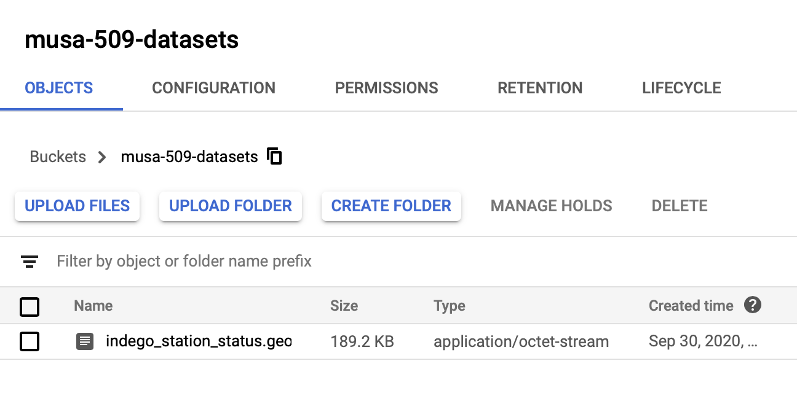
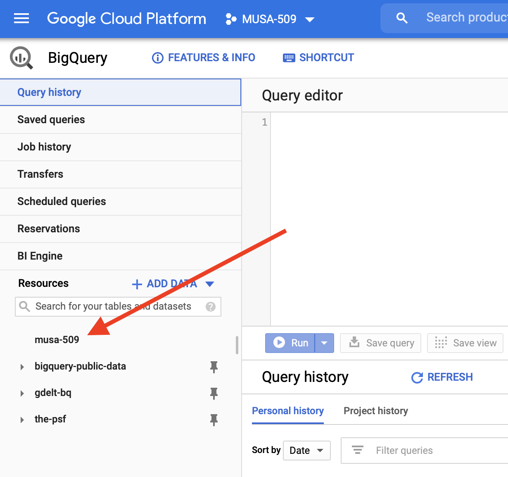
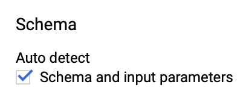
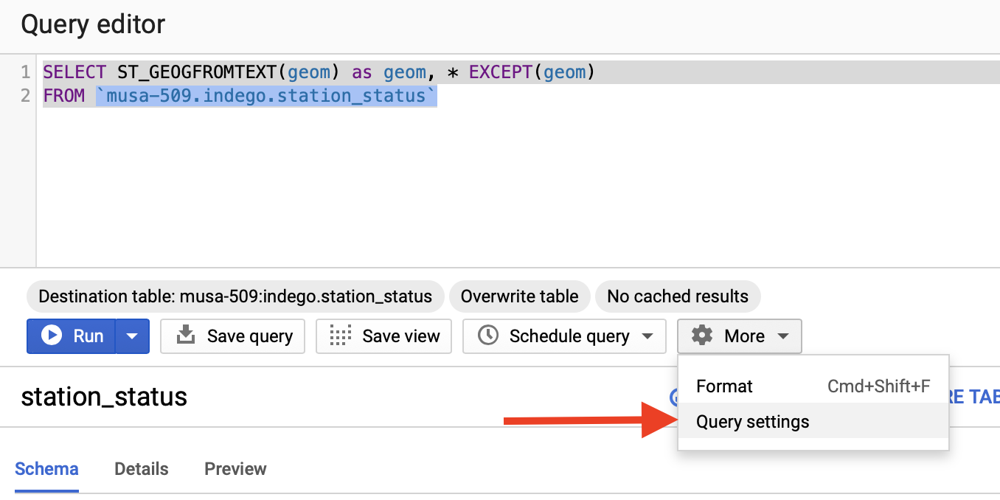
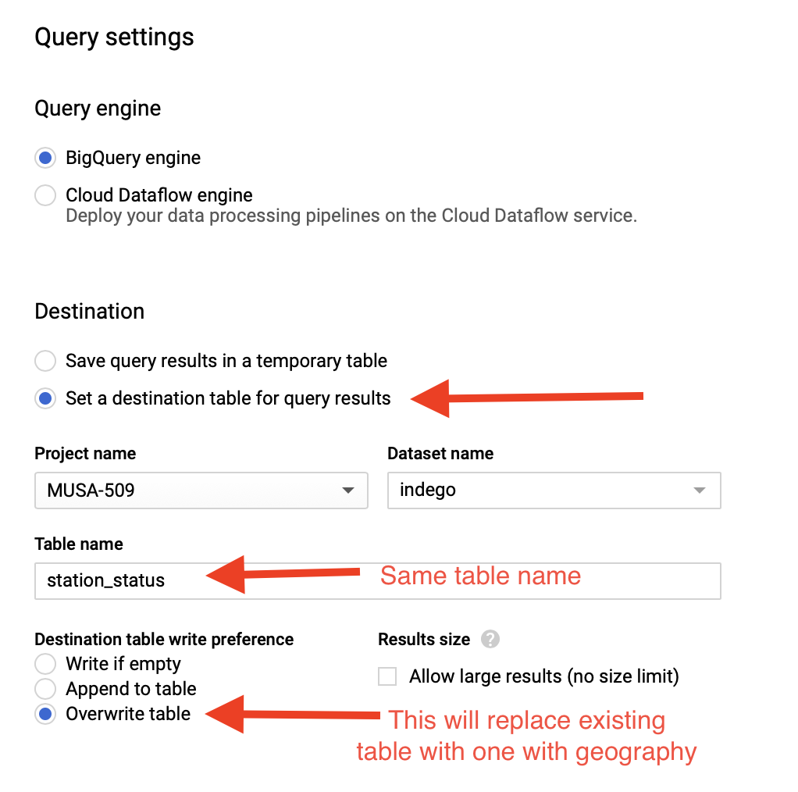
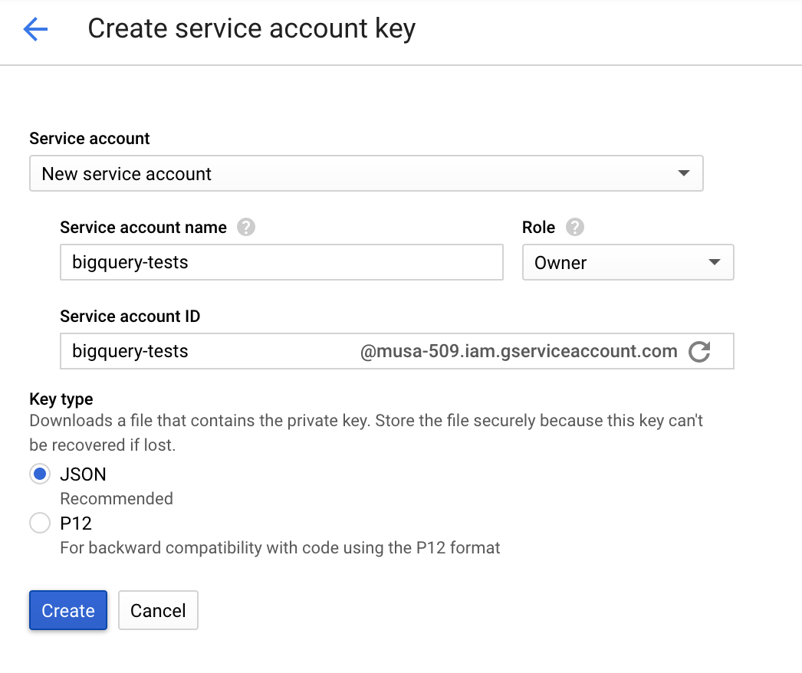

# Week 5 Lab -- Geospatial with BigQuery

0. Further homework hints, questions
1. Add a new table to BigQuery
2. Use BigQuery Python client to pull data and visualize in a Python environment


## Homework

**More CASE statments uses**

Use as a way to 'pivot' a GROUP BY. 

Let's use it to count stops by category (`location_type`). <https://gtfs.org/reference/static/#stopstxt>

```SQL
SELECT
  SUM(CASE WHEN location_type = 1 THEN 1 ELSE 0 END) as num_stations,
  SUM(CASE WHEN location_type = 2 THEN 1 ELSE 0 END) as num_entrances_exits,
  SUM(CASE WHEN location_type = 3 THEN 1 ELSE 0 END) as num_generic,
  SUM(CASE WHEN location_type = 4 THEN 1 ELSE 0 END) as num_boarding_areas
FROM stops
```

## Add a new table to BigQuery

**Create GCP Project**

1. Create a [project](https://cloud.google.com/resource-manager/docs/creating-managing-projects) in Google Cloud Platform (GCP) console
  
2. Click "New Project" in the upper right of the new dialog
3. Give it a useful name, like "MUSA-509" and create it.
4. After a few seconds, the project will be created. Now selected it from the project drop down.

**Add data to GCP Storage**

GCP Storage is similar to AWS S3. They're both cloud storage solutions with many built-in features. It's common for companies to share data via these services where they can granularly control permissions, access times, billing, etc.

1. Search in the console search bar for "Storage"
2. Select "Storage". This will list 'buckets' for your project. A bucket is a high-level storage unit, conceptually similar to a folder
3. Click "+ Create Bucket" and give it a useful name like `musa-509-datasets`
4. Upload our good old Indego station status dataset to this new bucket
  

**Add new table to BigQuery**

1. Search for BigQuery in the console search again
2. There should be a project listed in resources in the lower left
  
3. Select that project and create a new dataset for it called `indego` and accept all of the defaults
4. Select `+ Create Table` 
  a. Choose Google Cloud Storage for the source
    
  b. Give the table a name: `station_status`
  c. Under "Auto detect", check "Schema and input parameters". **Note** this will mean that our text field with the geometry won't be loaded
    
  d. Click "Create table"

**Add explicit geographic field**

The geography was detected as a string, so we need to change the table to have it as geography type instead.

1. Query the dataset, making sure your project, dataset, and table names are correct. Note the `EXCEPT` here. This means that all columns from the table are in the SELECT except for `geom`. At the same time, we can create a new column that parses the text in `geom` and aliases with a column of the same name.
  ```SQL
    SELECT ST_GEOGFROMTEXT(geom) as geom, * EXCEPT(geom)
    FROM `musa-509.indego.station_status`
  ```
2. Select Query Settings
  
3. Update the fields as they are here. This means that we will replace our existing table with the results of the query from above.
  
4. Run the query! And then check your table after if completes.


## BigQuery Python Client

1. Create Service Account Key: <https://console.cloud.google.com/apis/credentials/serviceaccountkey>
  
2. Save this file to your computer
3. Launch Binder for this weeks Lab: <https://mybinder.org/v2/gh/MUSA-509/week-5-geospatial-with-bigquery/master>
